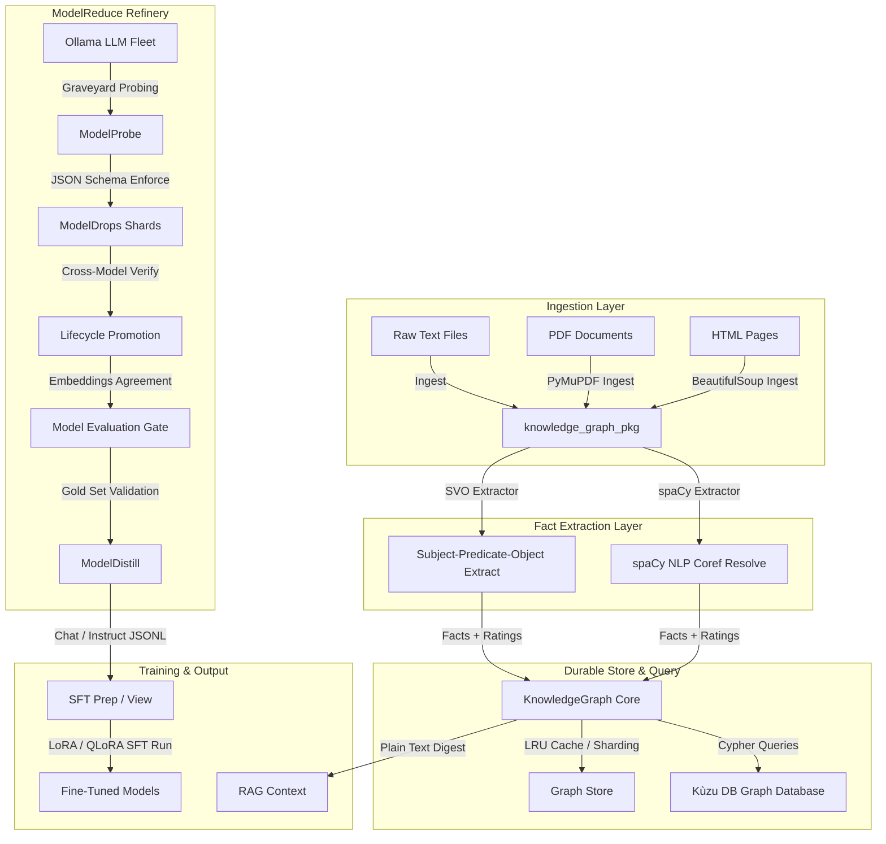

# Architecture: KnowledgeReduce Pipeline & ModelReduce Refineries

This document defines the high-level system architecture, data flow pipelines, directory layouts, and execution modules of the **KnowledgeReduce** and **ModelReduce** package.

---

## 🏛️ System Topology

The platform integrates document ingestion, semantic fact extraction, reliability rating schemas, persistent graph storage, LLM-based model probing, evaluation pipelines, and fine-tuning dataset generation.



---

## 📂 Project Directory Structure

```
├── pyproject.toml              # Dependencies, package metadata, mypy/pytest settings
├── CONTRIBUTING.md             # Developer playbook & local setup guide
├── ARCHITECTURE.md             # System topology and modular design reference
├── lessons_learned.md          # Registry of implementation and debugging insights
├── data/
│   └── gold_biochem.json       # Labeled biochemistry gold set for model evaluation
├── docs/
│   ├── ROADMAP.md              # V1 development milestones roadmap
│   ├── ROADMAP-v2.md           # V2 ongoing factory store roadmap
│   └── model_reduce_training.md# Tutorial guide for training models on distilled shards
├── knowledge_graph_pkg/        # Main source package
│   ├── cli.py                  # Entrypoint CLI command routing
│   ├── core.py                 # Core KnowledgeGraph structures and Reliability Ratings
│   ├── store.py                 # Simple file-based persistent storage
│   ├── ingest.py               # Document loading helpers (Text, HTML, PDF)
│   ├── extraction.py           # Subject-Predicate-Object (SVO) parser
│   ├── spacy_extractor.py      # Optional SpaCy & Coreference resolution backend
│   ├── distillation.py         # Fact filtering, deduplication, and token ranking
│   ├── distillation_io.py      # File export formatting (chat, instruction, plain text)
│   ├── factory.py              # Durable drop, catalog, and compilation pipeline
│   ├── kuzu_store.py           # Kùzu graph database connector
│   ├── graph_tool.py           # NetworkX graph manipulation and visualization helpers
│   ├── mcp_server.py           # Model Context Protocol JSON-RPC tool server
│   ├── model_probe.py          # Probing fleet (Ollama backend)
│   ├── probe_templates.py      # Domain-parameterized schemas and prompts
│   ├── model_drop.py           # Immutable model drops (shards)
│   ├── cross_model.py          # Cross-model agreement and semantic clustering
│   ├── embeddings.py           # Vector embedding wrappers (mxbai-embed-large)
│   ├── model_distill.py        # Agreement-based shard distillation
│   ├── model_eval.py           # Gold set validation and quality gating
│   ├── training_prep.py        # Token budget and training format preparation
│   └── graveyard.py            # Async model checkpointing and daemon discovery
├── scripts/
│   ├── run_suite.py            # Sequential stage-based test runner script
│   └── train_sft.py            # SFT LoRA training execution script (dry-run mode)
└── tests/                      # Reorganized test suite (30 test files)
```

---

## ⚙️ Core Modular Pipelines

### 1. Document Ingestion & Extraction (V1 Core)
Reads files (`.txt`, `.html`, `.pdf`) and feeds them into semantic extractors. The SVO parser uses rule-based parsing to extract relationships, while the spaCy parser provides full entity resolution, dependency structures, and coreference resolution (mapping pronouns like "she" or "it" back to the original entities to maintain fact independence).

### 2. KnowledgeGraph & Database Store
Facts are saved in a `KnowledgeGraph` backed by NetworkX. Reliability levels (e.g. `VERIFIED`, `LIKELY_TRUE`, `UNVERIFIED`) rating fact quality are assigned. Ingestion/catalog operations compile graphs into a KùzuDB instance, allowing Cypher query capabilities and fast path traversals.

### 3. ModelReduce Refinery (V2 Core)
ModelReduce targets local models (via Ollama) and prompts them using structured schemas to extract domain-specific knowledge facts. Probes are saved as drops. The pipeline:
1. **ModelProbe**: Extract raw JSON facts using schema enforcement.
2. **CrossModel Verification**: Group facts via embeddings cosine similarity and count how many models agree on a statement.
3. **Model Evaluation Gate**: Run against a local gold set. If agreement metrics don't meet target precision bounds, the gates fail (preventing downstream training on corrupted or hallucinated data).
4. **Distillation**: Output clean training datasets for fine-tuning.
