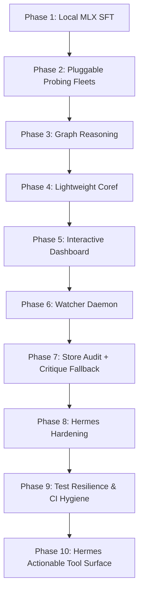

# KnowledgeReduce: Strategic Improvement Master Plan

This document outlines the identified technical gaps in the current **KnowledgeReduce** & **ModelReduce** architecture and structures a 10-phase implementation roadmap to enhance its scalability, local training efficiency, reasoning capacity, usability, and Hermes actionability.

---

## 🔍 Identified Architectural Gaps

1. **Local Fine-Tuning Constraints (No MLX support)**:
   * *Problem*: Session 7 ships SFT training preparation but relies on heavy CUDA-based pipelines (torch, PEFT, TRL, transformers) for actual training. This requires an Nvidia GPU. Running this pipeline on local Apple Silicon hardware (like a MacBook Air or Pro) is highly inefficient.
   * *Gap*: Lack of a lightweight, native macOS fine-tuning wrapper.

2. **Ollama Probing Fleet Lock-in**:
   * *Problem*: The `ModelProbe` layer is Ollama-only.
   * *Gap*: Cannot load local raw GGUF files directly (via `llama.cpp` bindings), query high-throughput local backends (like `vLLM`), or call remote APIs (like OpenAI, Anthropic, or Cohere) behind a unified probing interface.

3. **Heavy Dependency for Coreference Resolution**:
   * *Problem*: Resolving pronouns in extracted facts currently requires installing the optional `nlp` extra and downloading the large `spaCy` package and English model.
   * *Gap*: No lightweight, rule-based, dependency-free coreference resolver for fast CLI executions.

4. **Static Graph Store (Inactive Reasoning)**:
   * *Problem*: KùzuDB is integrated and nodes/edges are written, but the graph database acts as a passive index store.
   * *Gap*: Lacks active graph reasoning (e.g., path-based contradiction detection, transitive fact inference, or automated fact validation).

5. **No Telemetry or Interactive Visual Dashboard**:
   * *Problem*: The catalog store can only be inspected via command-line list tables or raw JSON logs.
   * *Gap*: No interactive interface (like Streamlit or Marimo notebooks) to visualize the knowledge graph topology, inspect drops, or trace evaluation precision.

6. **Static File Ingestion (No daemon watcher)**: 
   * *Problem*: Processing requires manual CLI invocations of `knowledgereduce distill` or `knowledgereduce drop`. 
   * *Gap*: No background watcher daemon to automatically ingest new files in real-time as they appear in a directory.
+
+7. **Agent Usability Gaps**: 
+   * *Problem*: The current workflow lacks a lightweight audit path and offline fallback for critique workflows. QA output is brittle for model training; bad phrasing can slip through. 
+   * *Gap*: No `audit-store` CLI to inspect drops/reliability, and `critique` assumes API backends with no rule-based fallback. 
+   * *Gap*: Hermes skill packaging is partial; no formal smoke command, remote verification step, or skill metadata registry.
+
+8. **Hermes Integration Hardening**: 
+   * *Problem*: The repo has a canonical skill artifact and optional extras, but missing formal registry metadata, remote sync verification, and agent-facing smoke sequences. 
+   * *Gap*: No repeatable skill install/verify workflow, no documented bounded-timeout defaults, and no explicit MCP tool schema surface for Hermes dispatch.

---

## 🗺️ Improvement Roadmap (Milestones Plan)

### 🎯 Phase 1: Local Apple Silicon Fine-Tuning (MLX-Based SFT)
* **Goal**: Provide a native macOS local fine-tuning runner using Apple's MLX Framework.
* **Tasks**:
  1. Add `mlx-lm` as an optional dependency (`pip install -e ".[mlx]"`).
  2. Implement `scripts/train_mlx.py` supporting LoRA and QLoRA fine-tuning for Apple Silicon GPUs.
  3. Expose `knowledgereduce train-mlx` CLI command to compile a shard and kick off local training in one line.
* **Success Metric**: Train a 1B to 3B model locally on Apple Silicon at > 1000 tokens/sec.

### 🎯 Phase 2: Pluggable Probing Fleets & Multi-Backends
* **Goal**: Break the Ollama-only dependency and support heterogeneous LLM backends.
* **Tasks**:
  1. Define a unified `BaseProbeBackend` protocol interface.
  2. Implement `LlamaCppBackend` for direct GGUF execution with local resource limits.
  3. Implement `vLLMBackend` for high-throughput local server deployments.
  4. Implement `OpenAICompatibleBackend` for API endpoints (OpenAI, Anthropic, Cohere).
  5. Decouple embeddings; support `sentence-transformers` for local offline vector generation.
* **Success Metric**: Probe a mix of local GGUFs and OpenAI endpoints concurrently using the same schemas.

### 🎯 Phase 3: Graph Reasoning & Path-Based Validation
* **Goal**: Turn KùzuDB from a passive index store into an active reasoning engine.
* **Tasks**:
  1. **Contradiction Detection**: Write automated Cypher queries to locate contradiction loops (e.g., `FactA` contradicts `FactB`).
  2. **Transitive Fact Inference**: Deduce secondary connections (e.g., if `A -> B` and `B -> C`, propose relationship `A -> C`).
  3. **Path Validation**: Use graph traversals to rate fact reliability (e.g., a fact connected to highly verified source nodes receives a higher rating).
* **Success Metric**: Automatically flag contradiction loops during evaluation.

### 🎯 Phase 4: Lightweight Dependency-Free Coreference Resolution
* **Goal**: Provide standard coreference resolution without downloading SpaCy.
* **Tasks**:
  1. Implement a rule-based pronoun resolver (`knowledge_graph_pkg/coref_simple.py`) using sentence distance, gender/number heuristics, and entity tracking.
  2. Integrate this resolver as the default fallback when `[nlp]` (spaCy) is not installed.
* **Success Metric**: Standard coreference resolution executes cleanly on core installations without importing spaCy.

### 🎯 Phase 5: Interactive Visual Dashboard (Marimo/Streamlit)
* **Goal**: Provide a premium visual interface for inspecting and controlling the pipeline.
* **Tasks**:
  1. Create a Streamlit or Marimo dashboard (`scripts/dashboard.py`).
  2. Visualizations:
     * Graph topology using D3 or PyVis.
     * Drops catalog metadata table and import timeline.
     * Evaluation precision/recall curves and calibration gates.
  3. Interactive controls to compile shards, run evaluation runs, or trigger model probes.
* **Success Metric**: Interactively explore, query, and visual-filter the knowledge graph in a web browser.

### 🎯 Phase 6: Real-Time Ingestion Watcher Daemon
* **Goal**: Automate ingestion via background watchers.
* **Tasks**:
  1. Implement a daemon using `watchdog` to monitor a specified directory (e.g., `data/ingest_watch/`).
  2. Automatically trigger `drop` pipelines as new TXT, HTML, or PDF files are added or modified.
  3. Log daemon activities and state to a sqlite database.
* **Success Metric**: Background ingestion of new papers/articles into the graph database within 5 seconds of file creation.

### 🎯 Phase 7: Store Audit + Critique Fallback
* **Goal**: Give agents and operators a lightweight inspection/audit CLI and an offline critique path so bad facts don’t silently enter training shards.
* **Tasks**:
  1. Add `audit-store` CLI: show recent drops, counts per reliability tier, missing fields, duplicate subjects.
  2. Add rule-based critique fallback when no LLM backend is configured: pronoun-subject checks, shallow duplicate detection, subject-verb agreement heuristics.
  3. Gate export/report commands on `audit-store` before DISTILL/CRITIQUE actions when confidence is low.
* **Success Metric**: Operator can run one repo-local command after DROP to see quality state; critique works without API access.

### 🎯 Phase 8: Hermes Hardening & Skill Packaging
* **Goal**: Make the repo fully Hermes-friendly from skill install to runtime verification.
* **Tasks**:
  1. Add canonical skill manifest under `.agents/skills/knowledge-reduce-core/SKILL.md`.
  2. Add `.agents/skills.json` registry with canonical path and metadata.
  3. Add dedicated `hermes` optional extras in `pyproject.toml`, keeping base install dependency-light.
  4. Document install and mirror script (`scripts/mirror_skill.py`) in `README.md` and `CONTRIBUTING.md`.
  5. Document smoke commands and bounded timeout defaults in the skill file.
  6. Verify `python -m pytest -q` passes outside optional dependency clusters for core functionality.
  7. Add remote read-back instructions so maintainers can verify canonical skill reach GitHub after push.
* **Success Metric**: A fresh machine can install `.`, install Hermes skill, run smoke tests, and push without missing metadata.

### 🎯 Phase 9: Test Resilience & CI Hygiene
* **Goal**: Make `python -m pytest -q` reliable on a minimal install instead of failing during collection when optional extras are missing.
* **Tasks**:
  1. Add `tests/conftest.py` pytest guards/skip markers keyed to extras like `viz`, `graph`, `nlp`, and external API clients.
  2. Update optional-dependency test files to skip cleanly when their extras are absent.
  3. Verify the stage runners report skipped tests explicitly and do not abort core test execution.
  4. Add a CI/automation-friendly verification command that runs core smoke tests without optional deps.
* **Success Metric**: `pip install -e .` followed by `python -m pytest -q` completes without missing-import collection failures.

### 🎯 Phase 10: Hermes Actionable Tool Surface
* **Goal**: Make the skill directly useful for Hermes dispatch by exposing the repo's actual tool surface and preferred invocation patterns.
* **Tasks**:
  1. Add a `## Tool surface` section to `.agents/skills/knowledge-reduce-core/SKILL.md` that lists Hermes-callable capabilities, including `GraphTools` methods and `TOOL_SCHEMAS`.
  2. Add `## Preferred invocation` guidance in the skill: use local `GraphTools(...)` first; use HTTP/`serve-mcp` only when an external LLM runtime needs MCP.
  3. Add `## Hermes prompt patterns` with concrete request/response examples for `distill`, `drop`, `catalog`, `compile`, `serve-mcp`, and MCP `GET /tools` / `POST /tools/call`.
  4. Add `## Safety/timeout defaults` with explicit bounds for CLI/MCP operations.
  5. Document MCP/tool introspection commands:
     - `python -c "from knowledge_graph_pkg.mcp_server import list_tools; print(list_tools())"`
     - `python -m knowledge_graph_pkg --help`
     - `python -m knowledge_graph_pkg eval --gold data/gold_set.json`
* **Success Metric**: A Hermes agent can read the skill and immediately know how to call distillation, store inspection, and tool-serving operations without extra lookup.

